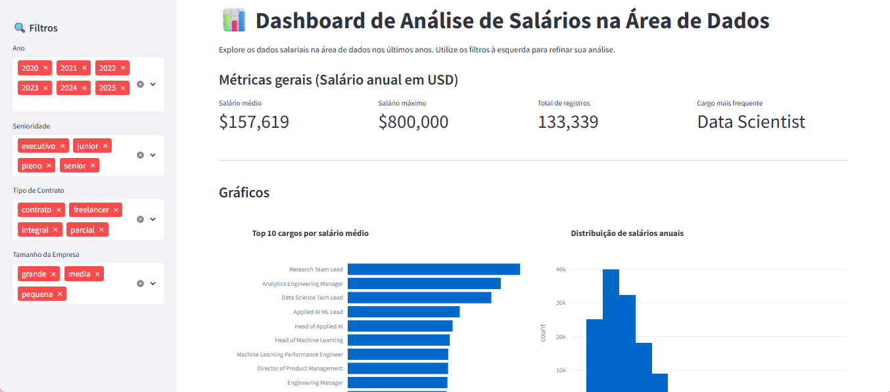

# Dashboard Interativo - Salários de Profissionais da Área de Dados

Este projeto é um **Dashboard Interativo** desenvolvido em **Python** utilizando:
- [Pandas](https://pandas.pydata.org/) para manipulação e análise de dados.
- [Streamlit](https://streamlit.io/) para criação da interface interativa.
- [Plotly](https://plotly.com/python/) para visualizações gráficas.

O objetivo é explorar dados salariais de profissionais da área de dados de forma visual e dinâmica.

## Pré-requisitos

Antes de iniciar, verifique se você possui instalado em seu sistema:
- [Python 3.9+](https://www.python.org/downloads/)
- [Git](https://git-scm.com/)

## Estrutura de pastas
```bash
.
├── app.py                 # código principal do dashboard
├── data/                  # arquivos CSV 
├── requirements.txt       # lista de dependências
└── README.md              # este guia
```

## Screenshots



## Como utilizar

Você pode baixar este projeto em arquivo .zip, clicando no botão <b>Code</b>, ou então seguir os passos abaixo para clonar o repositório em seu dispositivo:

```bash
# Clone o repositório 
git clone https://github.com/Debora-Carvalho/python-dashboard-salaries.git

# Entre no repositório
cd python-dashboard-salaries
```

Se for a primeira vez em que está rodando o projeto, crie o ambiente virtual:
```bash
# Windows (PowerShell)
python -m venv .venv
.venv\Scripts\Activate
```

```bash
# macOS/Linux
python3 -m venv .venv
source .venv/bin/activate
```

```bash
# Instale as dependências
pip install -r requirements.txt
```

Depois de configurar, sempre que quiser rodar novamente execute:

```bash
# Windows (PowerShell)
.venv\Scripts\Activate
```

```bash
# macOS/Linux
source .venv/bin/activate
```

E então, rode localmente com o Streamlit:
```bash
streamlit run app.py
```

O dashboard estará na porta:
```bash
http://localhost:8501
```

## Author

| [<br><sub>Débora Carvalho</sub>](https://github.com/Debora-Carvalho) |
| :---------------------------------------------------------------------------------------------------------------------------------------: |
|                                            [Linkedin](www.linkedin.com/in/debora-vieira-carvalho-45a478205)                                             |

<br />

Última atualização: ago.2025